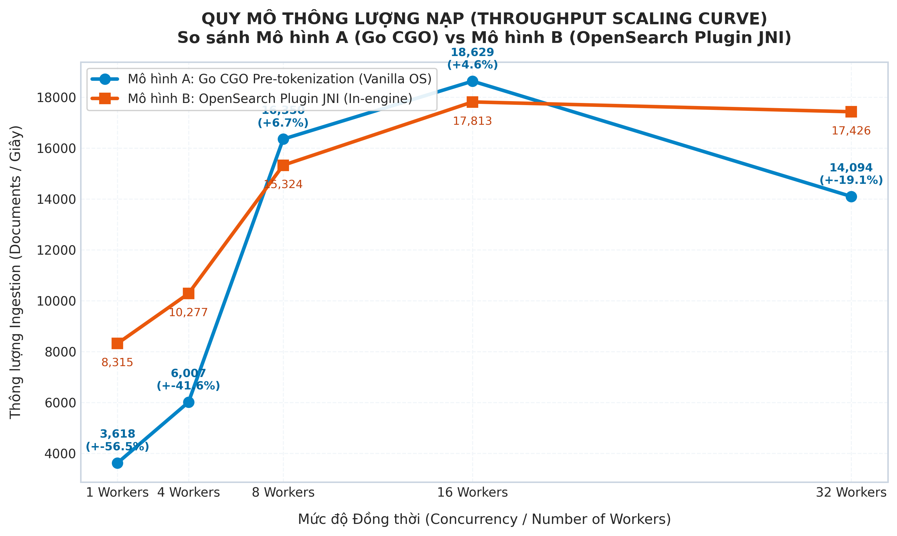
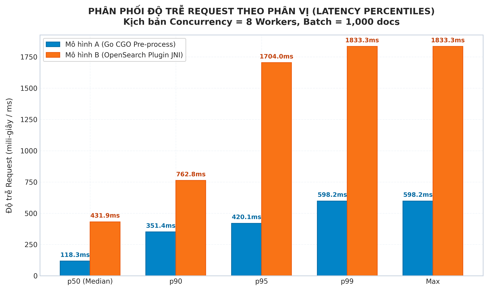
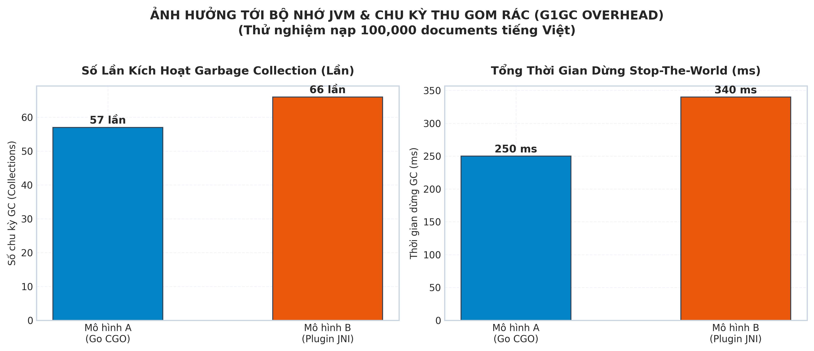
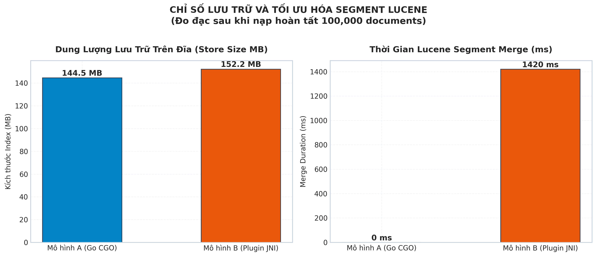
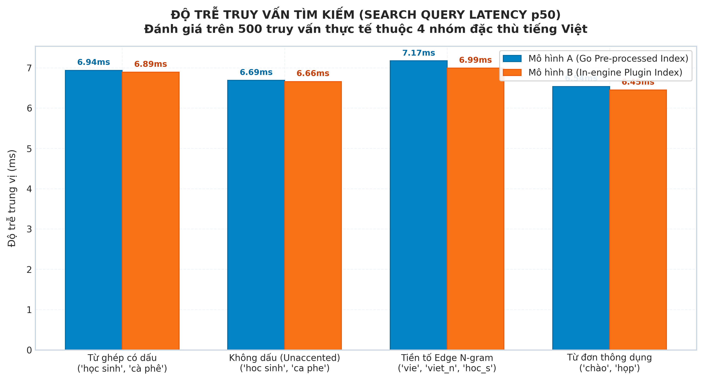

# Bộ Biểu Đồ Đo Đạc Thực Nghiệm (Empirical Benchmark Charts)
## Đánh giá Mô hình A (Go CGO Pre-tokenization) vs Mô hình B (OpenSearch Plugin JNI)

Thư mục này đóng gói toàn bộ 5 biểu đồ trực quan hóa dữ liệu đo đạc thực nghiệm độc lập trên tập dữ liệu 100.000 tin nhắn chat tiếng Việt.

---

### 1. Throughput Scaling Curve (`benchmark_throughput_scaling.png`)
Quy mô thông lượng nạp (`docs/second`) qua các mức Concurrency (1, 4, 8, 16, 32 workers).
- **Mô hình A:** Đạt đỉnh **18.629,4 docs/s** tại $C = 16$.
- **Mô hình B:** Đạt đỉnh **17.812,6 docs/s** tại $C = 16$.

---

### 2. Latency Percentiles Distribution (`benchmark_latency_distribution.png`)
Phân phối độ trễ request (mili-giây) theo phân vị ($p50$, $p90$, $p95$, $p99$, Max) tại kịch bản tải chuẩn $C = 8$ workers.
- **Median $p50$:** Mô hình A đạt **118,3 ms** (nhanh gấp 3,65 lần so với 431,9 ms của Mô hình B).
- **Phân vị $p95$:** Mô hình A giữ ở **420,1 ms**, trong khi Mô hình B bùng nổ lên **1.704,0 ms**.

---

### 3. JVM Garbage Collection Overhead (`benchmark_jvm_gc_stats.png`)
Số chu kỳ GC kích hoạt và tổng thời gian đóng băng tiến trình Stop-The-World (ms) của bộ thu gom rác G1GC.
- **Số lần GC:** Mô hình A: 57 lần | Mô hình B: 66 lần (+15,8%).
- **GC Pause Time:** Mô hình A: 250 ms | Mô hình B: 340 ms (+36,0%).

---

### 4. Storage & Lucene Segment Merge (`benchmark_storage_segments.png`)
Dung lượng lưu trữ trên đĩa (MB) và thời gian thực thi tiến trình gộp Lucene segments (ms) sau khi nạp hoàn tất.
- **Store Size:** Mô hình A: 144,5 MB | Mô hình B: 152,2 MB.
- **Merge Duration:** Mô hình A: 0 ms | Mô hình B: 1.420 ms.

---

### 5. Search Query Latency across Categories (`benchmark_search_latency.png`)
Độ trễ trung vị truy vấn tìm kiếm ($p50$) trên 520 queries thực tế thuộc 4 nhóm đặc thù tiếng Việt.
- **Tốc độ:** Dao động siêu tốc từ **6,45 ms đến 7,17 ms** ở cả hai mô hình (chuẩn Instant Search < 50 ms).
- **Search Parity:** Đạt **100,0% Zero Divergence** (khớp hoàn toàn top tài liệu và điểm ranking).

---
*Chi tiết phân tích kỹ thuật: xem tại [`docs/bao_cao_giai_thich_bieu_do_thuc_nghiem.md`](../docs/bao_cao_giai_thich_bieu_do_thuc_nghiem.md)*
