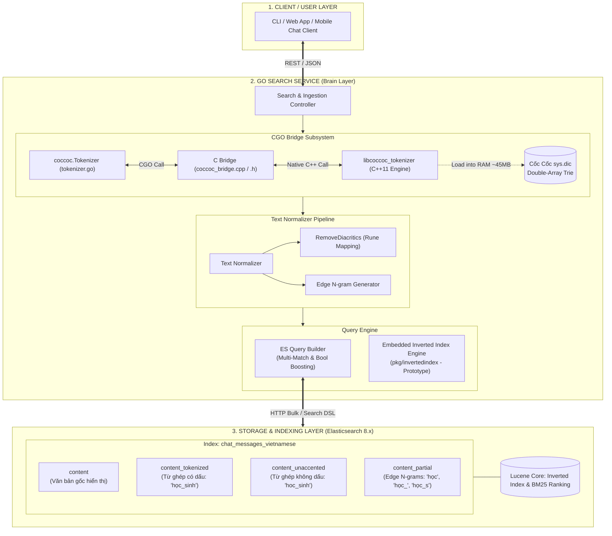
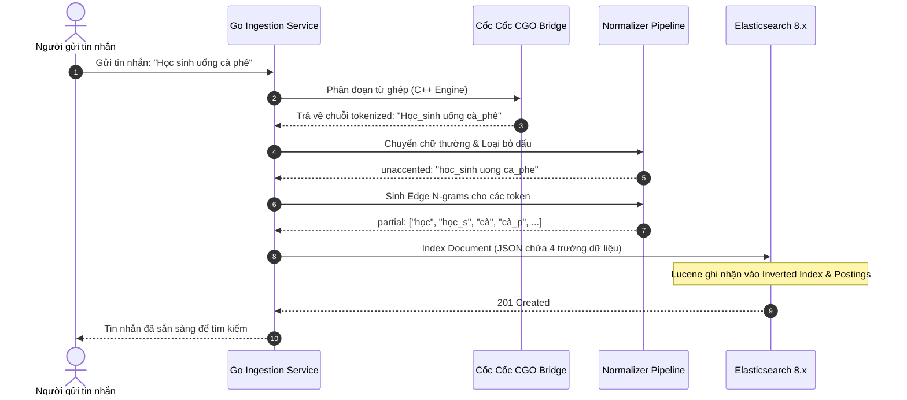
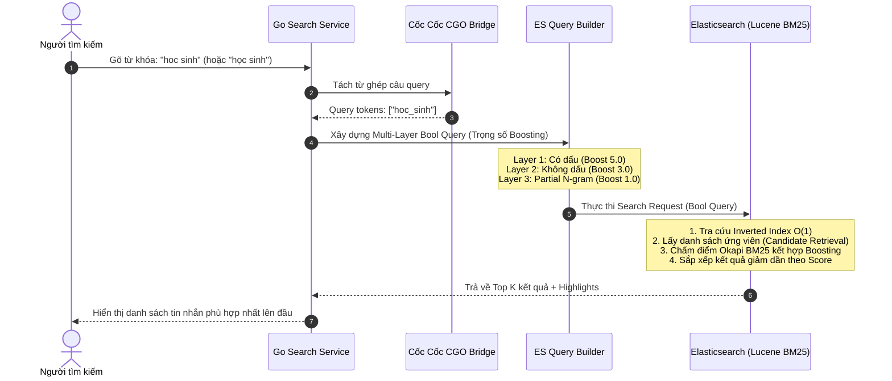

# Kiến Trúc Hệ Thống: Vietnamese Chat Search Engine

> **Tài liệu đặc tả kiến trúc toàn diện** cho hệ thống tìm kiếm tin nhắn chat tiếng Việt hiệu năng cao, kết hợp **Go (Golang)**, thư viện **Cốc Cốc Tokenizer (C++ qua CGO)** và động cơ tìm kiếm **Elasticsearch 8.x / Lucene Inverted Index**.

---

## 1. Bối Cảnh & Bài Toán Thực Tế (Problem Statement)

Trong các ứng dụng nhắn tin nhóm quy mô lớn (Group Chat), việc tìm kiếm lại tin nhắn cũ là tính năng cốt lõi. Tuy nhiên, việc áp dụng các công cụ tìm kiếm truyền thống (như MySQL `LIKE '%...%'` hoặc bộ phân tích mặc định `standard analyzer` của Elasticsearch) gặp thất bại nghiêm trọng vì đặc thù của tiếng Việt:

```
                            BÀI TOÁN TÌM KIẾM TIẾNG VIỆT
                                         │
     ┌───────────────────────────────────┼───────────────────────────────────┐
     ▼                                   ▼                                   ▼
[ 1. TỪ GHÉP ĐA ÂM TIẾT ]        [ 2. GÕ KHÔNG DẤU ]               [ 3. GÕ DỞ TỪ / TIỀN TỐ ]
Tìm: "học sinh"                  Tìm: "ca phe"                     Tìm: "cà ph" hoặc "sinh v"
- Bị lẫn: "nhập học", "sinh viên" - Phải khớp cả "cà phê"           - Phải gợi ý được "cà phê",
- Do tách rời theo khoảng trắng!  lẫn "ca phê" không dấu.          "sinh viên" (Autocomplete).
```

### Mục tiêu kiến trúc:
1. **Độ chính xác cấp độ từ (Word-level Precision):** Nhận diện chính xác ranh giới từ ghép tiếng Việt (`học_sinh` $\neq$ `học` + `sinh`).
2. **Đa dạng hình thái gõ (Accented & Unaccented Matching):** Tìm kiếm không dấu vẫn ra kết quả có dấu và ngược lại.
3. **Tìm kiếm tiền tố tức thời (Partial / Prefix Matching):** Tìm kiếm khi người dùng đang gõ dở từ.
4. **Xếp hạng thông minh (Relevance Scoring):** Kết quả đúng từ ghép có dấu luôn đứng đầu, tiếp theo là không dấu, cuối cùng là khớp tiền tố.

---

## 2. Kiến Trúc Tổng Thể Hệ Thống (High-Level Architecture)

Hệ thống được thiết kế theo mô hình phân tầng hướng dịch vụ, trong đó **Go Service** đóng vai trò là "Bộ não điều phối" (Brain/Orchestrator) kết hợp sức mạnh phân tích ngôn ngữ tự nhiên C++ và năng lực chỉ mục phân tán của Elasticsearch.



---

## 3. Bản Chất Các Tầng Thành Phần (Component Deep-Dive)

### 3.1. Tầng NLP Tokenizer Cốc Cốc qua CGO (`pkg/tokenizer/coccoc`)
Đây là trái tim xử lý ngôn ngữ tiếng Việt của dự án:
* **Lõi C++ Cốc Cốc (`coccoc-tokenizer`):** Sử dụng cấu trúc dữ liệu **Double-Array Trie** để tra cứu từ điển siêu tốc và giải thuật quy hoạch động **Viterbi** để tìm phương án phân đoạn từ có xác suất cao nhất trong câu.
* **C Interface Bridge (`coccoc_bridge.h` & `coccoc_bridge.cpp`):** Cung cấp các hàm C thuần (`extern "C"`) để Go có thể gọi qua CGO.
* **Quản lý bộ nhớ an toàn (Memory Safety across Boundary):**
  - Chuỗi Go đẩy sang C qua `C.CString(str)` $\rightarrow$ Cấp phát trên C Heap.
  - Chuỗi kết quả từ C trả về Go qua `C.GoString(resPtr)`.
  - Sử dụng cơ chế `defer C.free(...)` và `defer C.coccoc_free_string(...)` để giải phóng bộ nhớ C ngay sau khi hoàn thành, ngăn chặn tuyệt đối lỗi rò rỉ RAM (Memory Leak).
* **An toàn luồng (Thread-Safety):** Bọc bằng `sync.Mutex` để đảm bảo hàng trăm request đồng thời không gây tranh chấp tài nguyên (race condition) trên con trỏ C++ Engine.

---

### 3.2. Tầng Chuẩn Hóa Văn Bản (Text Normalization Pipeline)
Sau khi Cốc Cốc Tokenizer ghép các từ (ví dụ: `"học sinh"` $\rightarrow$ `"học_sinh"`), văn bản tiếp tục đi qua các bộ lọc:
1. **Lowercase Filter:** Đưa toàn bộ về chữ thường chuẩn để đảm bảo tìm kiếm không phân biệt hoa/thường.
2. **Unaccent Filter (`RemoveDiacritics`):**
   - Sử dụng bảng ánh xạ `map[rune]rune` và `strings.Builder`.
   - Chuyển đổi an toàn từng ký tự Unicode tiếng Việt sang dạng không dấu (`"cà_phê"` $\rightarrow$ `"ca_phe"`).
   - Dùng kiểu `rune` (int32) thay vì `byte` để tránh lỗi gãy byte tiếng Việt (UTF-8).
3. **Edge N-gram Filter (`GenerateEdgeNgrams`):**
   - Sinh các tiền tố có độ dài từ `minGram=2` đến `maxGram=15`.
   - Ví dụ: `"học_sinh"` $\rightarrow$ `["học", "học_", "học_s", "học_si", "học_sin"]`.
   - Cho phép người dùng gõ tìm kiếm khi chưa hoàn thành trọn vẹn từ.

---

### 3.3. Tầng Chỉ Mục & Động Cơ Tìm Kiếm
Hệ thống hỗ trợ 2 động cơ tìm kiếm tương thích hoàn toàn về mặt lý thuyết:

#### A. Động cơ Nhúng Thuần Go (`pkg/invertedindex` - Hands-on Engine)
Dùng cho môi trường chạy thử nghiệm độc lập trong bộ nhớ RAM:
- **`Dictionary map[string][]Posting`:** Bảng băm từ vựng ánh xạ sang danh sách tài liệu chứa từ đó (tra cứu $O(1)$).
- **`Posting{DocID, TermFrequency, Positions}`:** Lưu chi tiết mã tài liệu, số lần xuất hiện và vị trí để phục vụ tìm kiếm cụm từ (Phrase Search).
- **Thuật toán Okapi BM25 (`bm25.go`):** Cài đặt chính xác công thức chấm điểm của Lucene với $k_1 = 1.2$ (chặn spam từ khóa) và $b = 0.75$ (phạt tin nhắn quá dài lê thê).

#### B. Động cơ Phân Tán Quy Mô Lớn (Elasticsearch 8.x Cluster)
Dùng cho môi trường Production, lưu trữ hàng triệu tin nhắn:
- **Schema Đa Trường (Multi-Fields Index Mapping):**
```json
{
  "properties": {
    "content":           { "type": "text" },
    "content_tokenized":   { "type": "text", "analyzer": "whitespace" },
    "content_unaccented":  { "type": "text", "analyzer": "whitespace" },
    "content_partial":     { "type": "text", "analyzer": "whitespace" }
  }
}
```

---

## 4. Hai Luồng Dữ Liệu Cốt Lõi (The 2 Core Data Pipelines)

### 4.1. Luồng 1: Indexing Pipeline (Nạp & Đánh Chỉ Mục Tin Nhắn)

Luồng diễn ra mỗi khi có tin nhắn mới gửi vào group chat:



---

### 4.2. Luồng 2: Search & Ranking Pipeline (Truy Vấn & Xếp Hạng Kết Quả)

Luồng diễn ra khi người dùng gõ từ khóa vào ô tìm kiếm:



---

## 5. Chiến Lược Xếp Hạng & Trọng Số Điểm (Relevance Scoring & Boosting)

Điểm số cuối cùng của mỗi tin nhắn được tính toán bởi hàm tổng hợp trọng số:

$$\text{FinalScore} = \text{Score}_{\text{BM25}}(\text{tokenized}) \times 5.0 + \text{Score}_{\text{BM25}}(\text{unaccented}) \times 3.0 + \text{Score}_{\text{BM25}}(\text{partial}) \times 1.0$$

```
                           CHIẾN LƯỢC TRỌNG SỐ BOOSTING
┌────────────────────────────────────────────────────────┬─────────────┬───────────────────────────┐
│ Tầng tìm kiếm (Match Layer)                            │ Hệ số Boost │ Mục đích nghiệp vụ        │
├────────────────────────────────────────────────────────┼─────────────┼───────────────────────────┤
│ 🥇 content_tokenized (Khớp từ ghép có dấu chính xác)   │     5.0     │ Đảm bảo tin nhắn chuẩn    │
│    Ví dụ: Query "học sinh" khớp trúng "học_sinh"       │ (Cao nhất)  │ tiếng Việt luôn đứng Top 1│
├────────────────────────────────────────────────────────┼─────────────┼───────────────────────────┤
│ 🥈 content_unaccented (Khớp từ ghép không dấu)         │     3.0     │ Hỗ trợ người dùng gõ nhanh│
│    Ví dụ: Query "hoc sinh" khớp trúng "hoc_sinh"       │ (Trung bình)│ không dấu vẫn tìm thấy    │
├────────────────────────────────────────────────────────┼─────────────┼───────────────────────────┤
│ 🥉 content_partial (Khớp tiền tố Edge N-gram)          │     1.0     │ Phục vụ tính năng gõ dở từ│
│    Ví dụ: Query "học s" khớp tiền tố "học_s"           │  (Dự phòng) │ hoặc gợi ý Autocomplete   │
└────────────────────────────────────────────────────────┴─────────────┴───────────────────────────┘
```

---

## 6. Cấu Trúc Mã Nguồn (Directory Layout & Responsibilities)

```text
d:/CODE/VSF/vietnamese-chat-search/
├── cmd/
│   ├── demo_engine/           # CLI demo Inverted Index & BM25 thuần Go (Interactive Shell)
│   ├── indexer/               # Tool nạp dữ liệu từ sample_messages.json vào Elasticsearch
│   └── searcher/              # Ứng dụng tìm kiếm & đối soát kết quả (Benchmark & Compare)
│
├── pkg/
│   ├── invertedindex/         # Lõi Động cơ Tìm kiếm mô phỏng Lucene thuần Go
│   │   ├── types.go           # Cấu trúc Document, Posting, InvertedIndex
│   │   ├── analyzer.go        # StandardAnalyzer, VietnameseAnalyzer, Unaccent, Edge N-gram
│   │   ├── coccoc_analyzer.go # Bộ Analyzer tích hợp Cốc Cốc qua CGO
│   │   ├── index.go           # Logic đánh chỉ mục, nạp dữ liệu, thống kê avgdl
│   │   ├── bm25.go            # Thuật toán tính điểm xếp hạng Okapi BM25 chuẩn Lucene
│   │   └── search.go          # Luồng tìm ứng viên (Boolean OR) và xếp hạng (Ranking)
│   │
│   ├── tokenizer/
│   │   └── coccoc/            # Cầu nối CGO giao tiếp C++ Cốc Cốc Tokenizer
│   │       ├── coccoc_bridge.h    # Khai báo C-interface thuần (extern "C")
│   │       ├── coccoc_bridge.cpp  # Triển khai gọi thư viện C++ và nạp sys.dic
│   │       ├── tokenizer.go       # Go wrapper an toàn luồng và quản lý giải phóng bộ nhớ
│   │       └── tokenizer_test.go  # Unit test kiểm tra độ chính xác tách từ ghép
│   │
│   └── es/                    # Tầng giao tiếp với Elasticsearch (Client, Mapping, Builder)
│
├── docker/
│   ├── docker-compose.yml     # Khởi tạo cụm Elasticsearch 8.x + Kibana
│   └── Dockerfile             # Môi trường build đa nền tảng (GCC, CMake, Go 1.21, CGO)
│
├── data/
│   └── sample_messages.json   # Tập dữ liệu mẫu tin nhắn chat tiếng Việt
│
├── docs/                      # Hồ sơ tài liệu chuyên sâu của dự án
│   ├── architecture.md        # [BẠN ĐANG ĐỌC] Bản vẽ và giải thích kiến trúc toàn hệ thống
│   ├── search_engine_fundamentals.md # Cẩm nang lý thuyết Inverted Index, Analysis & BM25
│   ├── coccoc_tokenizer_and_cgo_guide.md # Cẩm nang chi tiết về CGO và Cốc Cốc
│   ├── ir_book_ch1_ch3_notes.md # Tổng kết Chương 1-3 sách Information Retrieval
│   └── ir_book_ch6_ch7_notes.md # Tổng kết Chương 6-7 sách Information Retrieval (Vector & Scoring)
│
└── w3schools_go/              # Khóa thực hành 16 chương Golang toàn diện theo W3Schools
```

---

## 7. Tóm Tắt Tinh Thần Cốt Lõi

> 🌟 **Kiến trúc Vietnamese Chat Search là sự kết hợp hài hòa:**
> 1. Dùng **C++ Cốc Cốc Engine** để hiểu đúng ngữ pháp và từ ghép tiếng Việt.
> 2. Dùng **Go (Golang)** làm tầng trung gian siêu nhẹ, an toàn bộ nhớ và xử lý đồng thời hàng nghìn kết nối.
> 3. Dùng **Inverted Index & BM25 Ranking** để tìm kiếm siêu tốc trong $O(1)$ và đưa tin nhắn liên quan nhất lên đầu.
