# Đặc Tả Lý Thuyết & Thiết Kế Động Cơ Lưu Trữ & Chỉ Mục Riêng (Custom Search Storage Engine)
## Vietnamese Chat Search - Self-Engineered Inverted Index & Binary Disk Persistence

> **Tài liệu lý thuyết & đặc tả kỹ thuật** dành cho động cơ tìm kiếm và lưu trữ nhị phân độc lập tự xây dựng (Embedded Custom Engine), hoạt động song song và đối chứng với cụm Elasticsearch 8.x.  
> **Tác giả:** Đội ngũ Kỹ thuật Phát triển Hệ thống  
> **Ngày phát hành:** 2026-09-24  
> **Phiên bản:** v1.0 - Core Engine Persistence Specification  

---

## 📑 Mục Lục
1. [Bản Chất Lý Thuyết Lưu Trữ Trong Search Engine](#1-bản-chất-lý-thuyết-lưu-trữ-trong-search-engine)
   - 1.1. So sánh: Database B-Tree vs Search Engine Inverted Index
   - 1.2. Hạn chế của In-Memory Map và bài toán lưu trữ đĩa (Disk I/O Bottleneck)
   - 1.3. Triết lý phân đoạn bất biến (Immutable Segment Architecture) & LSM-Tree
2. [Cấu Trúc Định Dạng File Nhị Phân Trên Đĩa (Custom Binary File Format Spec)](#2-cấu-trúc-định-dạng-file-nhị-phân-trên-đĩa-custom-binary-file-format-spec)
   - 2.1. Bản đồ cấu trúc thư mục lưu trữ (`data/custom_storage/`)
   - 2.2. Chi tiết nhị phân: Header `segments.meta`
   - 2.3. Chi tiết nhị phân: Kho tài liệu gốc `docstore.dat` & `docstore.idx` (Forward Index)
   - 2.4. Chi tiết nhị phân: Từ điển `terms.dict` & Danh sách Postings `postings.bin`
   - 2.5. Cơ chế Xóa qua Tombstone `tombstone.del`
   - 2.6. Nhật ký ghi trước chống sập nguồn `wal.log` (Write-Ahead Log)
3. [Quy Trình Vận Hành Cốt Lõi (Core Engine Workflows)](#3-quy-trình-vận-hành-cốt-lõi-core-engine-workflows)
   - 3.1. Luồng Ghi Dữ Liệu: WAL $\to$ MemTable $\to$ Flush to Segment
   - 3.2. Luồng Khôi Phục Dữ Liệu (Crash Recovery Lifecycle)
   - 3.3. Luồng Truy Vấn & Xếp Hạng BM25 Trực Tiếp Trên Đĩa
4. [Mô Hình Vận Hành Song Song Dual-Engine (Custom Engine vs Elasticsearch 8.x)](#4-mô-hình-vận-hành-song-song-dual-engine-custom-engine-vs-elasticsearch-8x)
   - 4.1. Kiến trúc phân luồng Dispatcher
   - 4.2. Bảng ma trận tiêu chí đánh giá đối chứng (Benchmark Matrix)
5. [Lộ Trình Triển Khai Mã Nguồn Chi Tiết](#5-lộ-trình-triển-khai-mã-nguồn-chi-tiết)

---

## 1. Bản Chất Lý Thuyết Lưu Trữ Trong Search Engine

### 1.1. So Sánh: Database B-Tree vs Search Engine Inverted Index

Trong khoa học máy tính và hệ quản trị cơ sở dữ liệu:
- **Cơ sở dữ liệu quan hệ (RDBMS - MySQL, PostgreSQL):**
  - Dữ liệu được tổ chức theo dòng (Row-oriented).
  - Chỉ mục B-Tree / B+Tree được thiết kế để tìm kiếm chính xác khóa chính (`id = 123`) hoặc phạm vi (`age BETWEEN 20 AND 30`) trong thời gian $O(\log N)$.
  - Khi tìm kiếm toàn văn bản (Full-text query) như *"học sinh uống cà phê"*, B-Tree bất lực và bắt buộc phải quét cạn bảng (Full Table Scan `LIKE '%...%'`) với độ phức tạp $O(N \times L)$, làm sập CPU khi dữ liệu đạt hàng triệu tin nhắn.
- **Động cơ tìm kiếm (Search Engine - Lucene, Elasticsearch & Custom Engine):**
  - Sử dụng cấu trúc **Chỉ mục đảo (Inverted Index)**: Ánh xạ ngược từ từng **Thuật ngữ (Term)** sang danh sách các tài liệu chứa thuật ngữ đó (**Postings List**).
  - Tra cứu từ vựng trong thời gian tức thời $O(1)$ hoặc $O(\log V)$ (với $V$ là kích thước từ điển từ vựng, nhỏ hơn rất nhiều so với tổng số tin nhắn $N$).

### 1.2. Hạn Chế Của In-Memory Map & Bài Toán Lưu Trữ Đĩa (Disk I/O Bottleneck)

Ở Phase 1 của dự án, `pkg/invertedindex` lưu trữ chỉ mục trong bộ nhớ RAM qua cấu trúc:
```go
Dictionary map[string][]Posting
```
Mô hình này có 3 nhược điểm chí mạng trong môi trường sản xuất thực tế:
1. **Volatile (Mất trắng dữ liệu khi tắt máy/crash):** Khi tắt ứng dụng hoặc mất điện đột ngột, toàn bộ chỉ mục trong RAM biến mất, bắt buộc phải đọc lại toàn bộ dữ liệu nguồn và tính toán phân tích từ vựng từ đầu.
2. **RAM Exhaustion:** Khi dữ liệu chat tăng lên hàng chục gigabytes, RAM máy chủ sẽ bị tràn (Out of Memory).
3. **Chi phí Disk I/O ngẫu nhiên:** Nếu ghi đè ngẫu nhiên (Random Disk Write) mỗi khi có 1 tin nhắn mới, đầu đọc đĩa HDD/SSD sẽ bị tắc nghẽn IOPS nghiêm trọng.

### 1.3. Triết Lý Phân Đoạn Bất Biến (Immutable Segment Architecture) & LSM-Tree

Để giải quyết bài toán trên, các search engine hiện đại hàng đầu thế giới (Apache Lucene) và các cơ sở dữ liệu NoSQL (Google Bigtable, RocksDB) đều áp dụng triết lý **LSM-Tree (Log-Structured Merge-Tree)** và **Segment Bất Biến (Immutability)**:

```
                            TRIẾT LÝ LƯU TRỮ IMMUTABLE SEGMENT
                            
  [ Tin Nhắn Mới ] ───────► 1. Ghi tuần tự Append-only vào WAL (wal.log)
                                       │
                                       ▼
                            2. Nạp vào MemTable (RAM Inverted Index)
                               (Người dùng tìm kiếm thấy ngay tức thì)
                                       │
                                       ▼ (Khi RAM đạt ngưỡng hoặc gọi Flush())
                            3. Flush nguyên khối xuống file Segment nhị phân trên Đĩa
                               (File BẤT BIẾN - Read-Only, không bao giờ sửa đè)
                                       │
                                       ▼
                            4. Xóa/Sửa dùng Tombstone (.del)
                               (Không sửa file dữ liệu cũ, chỉ ghi cờ xóa)
```

**Các nguyên tắc cốt lõi cần ghi nhớ:**
1. **Tính Bất Biến (Immutability):** Một khi một file Segment đã được ghi và commit xuống đĩa, nó **vĩnh viễn là Read-Only**. Không có bất kỳ luồng nào được mở file ra để sửa byte tại chỗ.
   - *Lợi ích:* Không bao giờ xảy ra xung đột khóa (Lock Contention) khi đọc đồng thời; hàng trăm luồng tìm kiếm có thể đọc song song mà không cần Mutex chặn; tận dụng tối đa cơ chế bộ nhớ đệm trang của hệ điều hành (**OS Page Cache**).
2. **Ghi Tuần Tự (Sequential Write):** Đĩa cứng (kể cả SSD NVMe) luôn có tốc độ ghi tuần tự (Sequential I/O) nhanh hơn gấp hàng chục đến hàng trăm lần so với ghi ngẫu nhiên (Random I/O). Việc ghi Append-only giúp hệ thống đạt throughput tối đa.
3. **Cơ chế Tombstone (`.del`):** Sửa một tin nhắn thực chất là: Đánh dấu xóa DocID cũ trong file Tombstone, và thêm DocID mới vào Segment kế tiếp.

---

## 2. Cấu Trúc Định Dạng File Nhị Phân Trên Đĩa (Custom Binary File Format Spec)

Toàn bộ dữ liệu của Custom Engine được cô lập an toàn trong thư mục `data/custom_storage/`:

```text
data/custom_storage/
├── segments.meta         # [Header] Metadata tổng thể (N, avgdl, version, magic byte)
├── terms.dict            # [Dictionary] Danh sách từ vựng đã sort Alphabet + Offset sang postings
├── postings.bin          # [Inverted Index] Danh sách Postings nhị phân (DocID, TF, Positions)
├── docstore.idx          # [Forward Index Offset] Mốc offset byte cố định: DocID -> ByteOffset
├── docstore.dat          # [Forward Index Data] Kho lưu nội dung tin nhắn gốc (ID, Sender, Content...)
├── tombstone.del         # [Tombstone] Danh sách DocID bị xóa để lọc bỏ khi search
└── wal.log               # [Write-Ahead Log] Nhật ký ghi trước chống sập nguồn
```

---

### 2.1. Chi Tiết Nhị Phân: Header `segments.meta`
File header định danh định dạng file và lưu các chỉ số thống kê phục vụ chấm điểm Okapi BM25:

| Vị Trí Byte | Tên Trường (Field) | Kiểu Dữ Liệu | Kích Thước | Ý Nghĩa Kỹ Thuật |
| :---: | :--- | :---: | :---: | :--- |
| `0..3` | `MagicNumber` | `uint32` | 4 bytes | Hằng số `0x56534653` ("VSFS" - Vietnamese Search File System). Kiểm tra file có bị hỏng hoặc sai định dạng không. |
| `4..5` | `Version` | `uint16` | 2 bytes | Phiên bản định dạng (hiện tại: `1`). |
| `6..13` | `TotalDocs` | `uint64` | 8 bytes | Tổng số tài liệu hợp lệ trong hệ thống ($N$ trong công thức BM25). |
| `14..21` | `TotalTokens` | `uint64` | 8 bytes | Tổng số lượng từ (tokens) trong toàn bộ các tin nhắn. |
| `22..29` | `AvgDocLength` | `float64` | 8 bytes | Độ dài trung bình của tin nhắn ($avgdl$ trong công thức BM25). |
| `30..33` | `LastDocID` | `uint32` | 4 bytes | DocID lớn nhất đã cấp phát. |
| `34..41` | `CreatedAt` | `int64` | 8 bytes | Unix timestamp (mili-giây) lúc tạo segment. |

*Tổng kích thước Header cố định:* **42 bytes**.

---

### 2.2. Chi Tiết Nhị Phân: Kho Tài Liệu Gốc `docstore.dat` & `docstore.idx` (Forward Index)

Khi thuật toán BM25 tìm ra Top 10 `DocID` phù hợp nhất, hệ thống cần truy xuất ngay văn bản gốc để hiển thị cho người dùng.
Để đạt tốc độ tra cứu **$O(1)$ tuyệt đối không cần quét file**, chúng tôi phân tách thành 2 file:

```
[ docstore.idx (Mỗi bản ghi cố định 12 bytes) ]
┌────────────────────────┬────────────────────────┐
│ Vị trí: DocID * 12 byte│ [ByteOffset (uint64)]  │ ──► Trỏ thẳng đến vị trí byte trong docstore.dat
│                        │ [DataLength (uint32)]  │
└────────────────────────┴────────────────────────┘

[ docstore.dat (Dữ liệu biến thiên) ]
ByteOffset ──► [ID (4B)] + [SenderLen (2B)] + [Sender] + [RoomLen (2B)] + [Room] + [ContentLen (4B)] + [Content] + [Timestamp (8B)]
```

- **Truy xuất $O(1)$:** Muốn đọc tin nhắn có `DocID = 5`, hệ thống chỉ cần:
  1. Mở `docstore.idx`, nhảy (Seek) tới vị trí `5 * 12 = 60 byte`.
  2. Đọc 8 bytes `ByteOffset` và 4 bytes `DataLength`.
  3. Mở `docstore.dat`, nhảy thẳng tới `ByteOffset` và đọc chính xác `DataLength` bytes. Hoàn thành trong **dưới 1ms** mà không tốn RAM.

---

### 2.3. Chi Tiết Nhị Phân: Từ Điển `terms.dict` & Danh Sách Postings `postings.bin`

#### A. File `terms.dict`:
Chứa tất cả các từ vựng đã được chuẩn hóa (ví dụ: `cà_phê`, `học_sinh`, `ca_phe`, `cà_p`). Các từ vựng được **sắp xếp theo thứ tự bảng chữ cái A-Z**:

```
Cấu trúc mỗi Term Entry:
├── TermLen (uint16 - 2 bytes)       : Độ dài chuỗi UTF-8 của từ khóa
├── TermBytes ([]byte - TermLen byte): Chuỗi ký tự (ví dụ: "cà_phê")
├── DocFreq (uint32 - 4 bytes)       : Xuất hiện trong bao nhiêu tin nhắn (Document Frequency - DF)
├── PostingOffset (uint64 - 8 bytes) : Vị trí bắt đầu của danh sách Posting trong file postings.bin
└── PostingLength (uint32 - 4 bytes) : Độ dài vùng byte chứa Posting trong file postings.bin
```

*Lợi thế:* Nhờ sắp xếp thứ tự Alphabet, hệ thống có thể thực hiện **Binary Search (Tìm kiếm nhị phân)** để định vị từ khóa trong thời gian $O(\log V)$, hoặc nạp toàn bộ danh mục offset vào RAM cực kỳ gọn nhẹ (vài trăm KB).

#### B. File `postings.bin`:
Lưu trữ danh sách các tài liệu chứa từ khóa:

```
Vị trí PostingOffset ──►
├── [Số lượng Posting (uint32 - 4 bytes)]
└── Lặp lại danh sách các Posting:
    ├── DocID (uint32 - 4 bytes)        : ID của tin nhắn
    ├── TermFreq (uint32 - 4 bytes)     : Tần suất từ xuất hiện trong tin nhắn này (TF)
    ├── PosCount (uint16 - 2 bytes)     : Số lượng vị trí xuất hiện
    └── Positions ([]uint16 - 2*PosCount): Mảng vị trí token trong câu (phục vụ Phrase Search)
```

---

### 2.4. Cơ Chế Xóa Qua Tombstone `tombstone.del`

Khi người dùng xóa tin nhắn (`DELETE /api/messages/:id`):
- Hệ thống **không** đọc lại các file segment để xóa byte vì thao tác đó cực kỳ chậm và làm hỏng tính toàn vẹn của file.
- Hệ thống mở file `tombstone.del` và ghi nối đuôi một bản ghi: `[DocID (uint32 - 4 bytes)] + [DeletedAt (int64 - 8 bytes)]`.
- Khi thực thi truy vấn BM25, động cơ kiểm tra bảng băm Tombstone trong RAM (`map[uint32]bool`). Nếu `DocID` đã bị đánh dấu xóa, nó lập tức bị bỏ qua trước khi tính điểm xếp hạng.

---

### 2.5. Nhật Ký Ghi Trước Chống Sập Nguồn `wal.log` (Write-Ahead Log)

Khi có tin nhắn mới gửi đến:
1. Tin nhắn được mã hóa nhị phân và ghi nối đuôi (Append) ngay lập tức vào file `wal.log` trên đĩa và gọi `file.Sync()` để đẩy từ buffer hệ điều hành xuống đĩa vật lý.
2. Sau khi ghi WAL thành công, tin nhắn mới được đưa vào MemTable trong RAM.
3. **Cơ chế phục hồi (Crash Recovery):** Nếu server bị mất điện hoặc crash:
   - Khi khởi động lại, engine kiểm tra xem `wal.log` có chứa các tin nhắn chưa được Flush xuống segment hay không.
   - Nếu có, engine tự động đọc lại `wal.log`, nạp lại vào MemTable $\rightarrow$ **Đảm bảo tính bền vững (Durability) 100%, không mất tin nhắn nào**.
   - Sau khi Flush thành công xuống Segment, file `wal.log` được xóa trắng để bắt đầu chu kỳ mới.

---

## 3. Vòng Đời Của Một Tin Nhắn Được Ghi (The Life of a Write: Nhập Tin Nhắn -> Xử Lý -> Lưu Trữ Đâu?)

Khi một người dùng nhập một tin nhắn trên giao diện web (ví dụ: *"Chào các bạn học sinh mới uống cà phê"*), toàn bộ quy trình xử lý, phân luồng và địa điểm lưu trữ diễn ra theo **5 giai đoạn tuần tự** khép kín:

### 3.1. Sơ Đồ Luồng Dữ Liệu Chi Tiết (Data Flow Architecture)


*Hình 3.1: Sơ đồ tuần tự thể hiện đường đi của dữ liệu từ khi bấm phím đến từng byte trên đĩa cứng*

```mermaid
sequenceDiagram
    autonumber
    actor User as 👤 Người Dùng (Web UI)
    participant API as 🌐 HTTP API Router (/api/messages)
    participant ChatMgr as 💬 Chat Manager (RAM State)
    participant WAL as 📝 WAL (data/custom_storage/wal.log)
    participant DocStore as 🗄️ DocStore (docstore.dat + docstore.idx)
    participant Analyzer as 🔍 Cốc Cốc Tokenizer Multi-Layer
    participant MemTable as 🧠 MemTable (Inverted Index RAM)
    participant ES as 🐘 Elasticsearch 8.x (Docker Cốc Cốc)
    participant DiskSeg as 💾 Disk Segments (terms.dict + postings.bin)

    User->>API: 1. Gửi tin nhắn mới (POST JSON: sender, room, content)
    API->>ChatMgr: 2. Cấp phát DocID tự tăng & Timestamp chuẩn
    ChatMgr-->>API: Trả về Message object đã định danh

    rect rgb(20, 35, 60)
    Note over API,MemTable: [KHỐI 1: GHI VÀO CUSTOM ENGINE THUẦN GO]
    API->>WAL: 3. AppendRecord (Write-Ahead Log chống mất điện)
    WAL-->>API: fsync() thành công (Đảm bảo an toàn đĩa cứng)
    API->>DocStore: 4. AppendMessage vào docstore.dat & docstore.idx (Tra cứu O(1))
    DocStore-->>API: Ghi xong Offset nhị phân
    API->>Analyzer: 5. Bóc tách ngôn ngữ (học_sinh, cà_phê, unaccented, n-grams)
    Analyzer-->>MemTable: 6. Nạp term, TF, Positions vào RAM Inverted Index
    end

    rect rgb(30, 50, 40)
    Note over API,ES: [KHỐI 2: GHI SONG SONG SANG ELASTICSEARCH 8.X]
    API-)ES: 7. Bắn goroutine ngầm: IndexSingleMessage (Async Bulk)
    end

    API-->>User: 8. HTTP 201 Created (Phản hồi tức thì < 5ms cho Client)

    rect rgb(50, 30, 60)
    Note over MemTable,DiskSeg: [KHỐI 3: KHI FLUSH HOẶC MEMTABLE ĐẠT NGƯỠNG]
    MemTable->>DiskSeg: 9. Sắp xếp Term A-Z, xả ra terms.dict & postings.bin
    DiskSeg->>WAL: 10. Truncate WAL (Xóa trắng log vì đã lưu segment vĩnh viễn)
    end
```



---

### 3.2. Dữ Liệu Được Lưu Ở Đâu? (Bản Đồ Thư Mục Vật Lý Trên Ổ Đĩa)

Toàn bộ dữ liệu của Custom Storage Engine được cô lập hoàn toàn trong thư mục [`data/custom_storage/`](file:///d:/CODE/VSF/vietnamese-chat-search/data/custom_storage) theo cấu trúc chuẩn của một Database Engine chuyên nghiệp:

```text
d:\CODE\VSF\vietnamese-chat-search\data\custom_storage\
├── wal.log                      <-- [1] Nhật ký ghi trước chống sập nguồn (Write-Ahead Log)
├── docstore.idx                 <-- [2] Bảng mục lục Offset 12 bytes/doc (Tra cứu O(1))
├── docstore.dat                 <-- [3] Kho dữ liệu toàn văn của toàn bộ tin nhắn gốc
├── tombstone.del                <-- [4] Danh sách DocID các tin nhắn đã bị xóa
└── segments\                    <-- [5] Thư mục chứa các Segments nhị phân bất biến
    └── seg_000001\
        ├── segments.meta        <-- Metadata thống kê: TotalDocs, TotalTokens, AvgDocLen
        ├── terms.dict           <-- Bảng từ điển nhị phân đã sắp xếp A-Z (Sorted Term Dictionary)
        └── postings.bin         <-- Danh sách vị trí xuất hiện (DocID, TF, Positions)
```

#### Chi tiết vai trò và cấu trúc nhị phân của từng file:

| Tên File Vật Lý | Kích Thước / Cấu Trúc | Nội Dung & Ý Nghĩa Kỹ Thuật | Tác Vụ Khi Nhập Tin Nhắn |
| :--- | :--- | :--- | :--- |
| **`wal.log`** | Biến thiên theo số tin nhắn chưa flush | Lưu `[Length 4B] + [CRC32 4B] + [Payload]`. Đảm bảo nếu server bị rút điện ngay lập tức, tin nhắn **vẫn còn nguyên vẹn trên đĩa**. | **Ghi ngay lập tức** trước khi làm bất kỳ việc gì khác. |
| **`docstore.idx`** | **Cố định chính xác 12 bytes/DocID** | Lưu cặp nhị phân: `ByteOffset uint64 (8B) + DataLength uint32 (4B)`. | Ghi nối đuôi 12 bytes vị trí con trỏ của tin nhắn vừa ghi. |
| **`docstore.dat`** | Biến thiên | Chứa dữ liệu toàn văn: ID, Sender, Room, Content, CreatedAt dưới dạng nhị phân nén. | Ghi nối đuôi chuỗi byte của tin nhắn. |
| **`terms.dict`** | Tạo ra khi Flush | Từ điển chứa các từ khóa tiếng Việt (`học_sinh`, `cà_phê`, `sinh_viên`...). Cho phép tìm kiếm nhị phân $O(\log N)$ cực nhanh. | Lưu trữ bất biến vĩnh viễn trên đĩa. |
| **`postings.bin`** | Tạo ra khi Flush | Chứa Posting List: danh sách các tài liệu chứa từ khóa đó, kèm số lần xuất hiện (TF) và vị trí từng chữ trong câu để tính BM25 và bôi màu highlight. | Lưu trữ bất biến vĩnh viễn trên đĩa. |
| **`tombstone.del`** | 4 bytes / mỗi Doc bị xóa | Đánh dấu xóa mềm (Soft Delete). Thay vì phải sửa lại file segment khổng lồ, engine chỉ ghi DocID bị xóa vào đây. Khi Search sẽ tự động bỏ qua. | Đọc khi tìm kiếm để lọc kết quả bị hủy. |

---

### 3.3. Từng Bước Xử Lý Cụ Thể Trong Mã Nguồn Go (Code Tracing)

Hãy theo chân một tin nhắn từ khi gửi đến khi yên vị trên đĩa cứng:

#### Bước 1: Tiếp nhận tại HTTP Controller
Tại file [`cmd/chat_server/main.go`](file:///d:/CODE/VSF/vietnamese-chat-search/cmd/chat_server/main.go#L154-L160):
- Server nhận payload JSON: `{"sender": "Lê Tuấn", "room": "Team Dự Án Search Engine", "content": "uống cà phê nhé"}`.
- Gọi `chatManager.PostMessage(...)`: Cấp phát ID duy nhất (ví dụ: `ID = 132`), gán thời gian hiện tại `time.Now()`.
- Lập tức chuyển giao Message struct cho Custom Engine qua lệnh:
  ```go
  if customEngine != nil {
      _ = customEngine.IndexMessage(msg)
  }
  ```

#### Bước 2: Bảo vệ tính bền vững (Durability) qua WAL
Tại file [`pkg/customengine/engine.go`](file:///d:/CODE/VSF/vietnamese-chat-search/pkg/customengine/engine.go#L110-L113) và [`pkg/storage/wal.go`](file:///d:/CODE/VSF/vietnamese-chat-search/pkg/storage/wal.go#L64-L100):
- Engine gọi `wal.Append(msg)`:
  - Tính mã kiểm tra toàn vẹn **CRC32 (IEEE)** của toàn bộ tin nhắn.
  - Ghi tuần tự xuống file `data/custom_storage/wal.log`.
  - Gọi lệnh `file.Sync()` của OS để ép phần cứng ghi từ bộ đệm xuống phiến đĩa.
  - *Kết quả:* Nếu máy tính bị sập nguồn ngay tại mili-giây này, khi bật máy lại, engine sẽ tự động Replay file WAL và khôi phục lại 100% tin nhắn vào bộ nhớ!

#### Bước 3: Lưu trữ toàn văn vào Forward Index (DocStore)
Tại file [`pkg/storage/docstore.go`](file:///d:/CODE/VSF/vietnamese-chat-search/pkg/storage/docstore.go#L54-L95):
- Engine gọi `docStore.AppendMessage(msg)`:
  - Lấy vị trí offset hiện tại của file `docstore.dat` (ví dụ: offset `48,210`).
  - Ghi tuần tự toàn văn bản tin nhắn vào `docstore.dat` với độ dài ví dụ là `145 bytes`.
  - Ghi chính xác 12 bytes vào `docstore.idx`: `[48210 (8 bytes)] + [145 (4 bytes)]`.
  - *Ý nghĩa:* Khi người dùng gõ tìm kiếm, tìm ra được DocID = 132, engine chỉ cần nhảy con trỏ tới vị trí `132 * 12` trên file `.idx` để đọc ra offset `48,210` và đọc đúng `145 bytes` từ `.dat`. **Tốc độ đọc tin nhắn là $O(1)$ tuyệt đối, chỉ đúng 1 lần đọc đĩa!**

#### Bước 4: Tách từ tiếng Việt đa tầng & Đưa vào Inverted Index (RAM MemTable)
Tại file [`pkg/customengine/engine.go`](file:///d:/CODE/VSF/vietnamese-chat-search/pkg/customengine/engine.go#L126-L204):
- Câu nói *"uống cà phê nhé"* được đưa qua Cốc Cốc Tokenizer:
  - **Tách từ có dấu chuẩn:** `uống` (pos 0), `cà_phê` (pos 1), `nhé` (pos 2).
  - **Sinh tiền tố Edge N-gram (hỗ trợ gợi ý tự động khi gõ dở chữ):** `cà`, `cà_`, `cà_p`, `cà_ph`, `cà_phê`.
  - **Sinh tầng không dấu (Unaccented):** `uong` (pos 0), `ca_phe` (pos 1), `nhe` (pos 2).
- Toàn bộ các Term này được map vào `memDictionary[term]` trong RAM:
  - Gắn liền với `DocID: 132`, `TF: 1`, `Positions: [1]`.
  - Người dùng có thể tìm thấy tin nhắn này **ngay lập tức trong RAM** với thời gian tính bằng micro-giây ($\mu s$).

#### Bước 5: Chuyển dịch xuống đĩa vĩnh cửu (Flush to Immutable Segment)
Tại file [`pkg/storage/segment.go`](file:///d:/CODE/VSF/vietnamese-chat-search/pkg/storage/segment.go#L24-L120):
- Khi lượng tin nhắn đạt ngưỡng (ví dụ: 100 tin) hoặc người dùng yêu cầu:
  - Engine lấy toàn bộ từ vựng trong RAM, sắp xếp theo bảng chữ cái A-Z (`sort.Strings(terms)`).
  - Ghi toàn bộ từ vựng sang file nhị phân `terms.dict`.
  - Ghi toàn bộ danh sách posting sang file nhị phân `postings.bin`.
  - Xóa trắng file `wal.log` vì dữ liệu đã chuyển hóa thành Segment đĩa vĩnh viễn không thể suy suyển.
- Nhờ cấu trúc Segment là **Bất Biến (Immutable)**, việc đọc tìm kiếm trên đĩa hoàn toàn không cần Lock, an toàn đa luồng 100% giữa hàng nghìn người cùng tìm kiếm đồng thời.

---

## 4. Mô Hình Vận Hành Song Song Dual-Engine (Custom Engine vs Elasticsearch 8.x)

Hệ thống triển khai mô hình **Bộ Điều Phối Kép (Dual Dispatcher)**:

```go
type DualSearchDispatcher struct {
    esClient     *es.Client             // Động cơ Elasticsearch 8.x phân tán
    customEngine *customengine.Engine   // Động cơ nhị phân tự xây dựng thuần Go
}
```

### 4.1. Luồng Ghi Song Song (Dual Indexing)
Mỗi khi có tin nhắn mới được gửi vào phòng chat:
- **Luồng 1:** Đẩy tin nhắn qua Cốc Cốc Tokenizer $\to$ Ghi vào Custom Engine (`customEngine.IndexMessage(...)`).
- **Luồng 2:** Đẩy tin nhắn qua Cốc Cốc Tokenizer $\to$ Ghi vào Elasticsearch qua Bulk API (`esClient.IndexSingleMessage(...)`).

### 4.2. Bảng Ma Trận Tiêu Chí Đánh Giá Đối Chứng (Benchmark Matrix)

Khi hoàn thành, chúng ta sẽ đo đạc và so sánh trực tiếp cả 3 động cơ trên cùng một bộ dữ liệu 131 tin nhắn và 12 kịch bản truy vấn:

| Tiêu Chí Kỹ Thuật | Custom Engine (Tự Xây Dựng) | Elasticsearch 8.x (Cốc Cốc) | Elasticsearch Baseline |
| :--- | :---: | :---: | :---: |
| **Công nghệ nền tảng** | Pure Go + Binary File Format | Java 17 + Lucene 9.8 (Docker) | Lucene Standard Analyzer |
| **Dung lượng RAM tiêu thụ** | **Siêu nhẹ (~15MB)** | Nặng (~1.2GB JVM Heap) | Nặng (~1.2GB JVM Heap) |
| **Thời gian khởi động** | **Tức thì (< 50ms)** | Chậm (15–30s khởi động container) | Chậm (15–30s khởi động) |
| **Độ trễ tìm kiếm (Latency)** | **Cực nhanh (loại trừ HTTP)** | Nhanh (~14ms qua REST HTTP) | Trung bình (~19ms qua REST) |
| **Độ chính xác (MRR)** | Kỳ vọng $\ge 0.75$ | Đạt **0.7708** | Đạt **0.6250** |
| **Mức độ phụ thuộc** | **Zero Dependency (1 file exe)** | Phụ thuộc Docker, JVM, Network | Phụ thuộc Docker, JVM, Network |

---

## 5. Lộ Trình Triển Khai Mã Nguồn Chi Tiết

- **Phase 1 (Hạ Tầng Lưu Trữ Nhị Phân):**
  - Xây dựng module `pkg/storage/binary_io.go`: Các hàm serialization LittleEndian.
  - Xây dựng module `pkg/storage/docstore.go`: Đọc/ghi tài liệu gốc vào `docstore.dat` và `docstore.idx` tra cứu $O(1)$.
  - Xây dựng module `pkg/storage/wal.go`: Ghi log tuần tự và replay khôi phục dữ liệu.
- **Phase 2 (Động Cơ Index & Persistence):**
  - Xây dựng module `pkg/customengine/engine.go`: Quản lý MemTable, định kỳ Flush ra `terms.dict` và `postings.bin`.
  - Hỗ trợ khởi động lại tự động load dữ liệu từ đĩa.
- **Phase 3 (Truy Vấn BM25 Đa Tầng Trên Custom Engine):**
  - Cài đặt multi-layer boosting (5.0 tokenized, 3.0 unaccented, 1.0 partial) trên file nhị phân.
- **Phase 4 (Tích Hợp Giao Diện Chat & Benchmark Đối Soát 3 Chiều):**
  - Nâng cấp Web Messenger hiển thị kết quả của cả 3 động cơ: Custom vs ES Vietnamese vs ES Baseline.

---
*(Tài liệu này được lưu trữ tại `docs/custom_storage_engine_spec.md` làm kim chỉ nam lý thuyết cho quá trình lập trình).*
