# HƯỚNG DẪN & MÃ NGUỒN VẼ TẤT CẢ SƠ ĐỒ, HÌNH VẼ TRONG BÁO CÁO THỰC TẬP

Tài liệu này cung cấp toàn bộ mã nguồn chuẩn **Mermaid.js** và **Chart.js** tương ứng với từng hình vẽ trong báo cáo [bao_cao_thuc_tap_hoan_thien.md](file:///d:/CODE/VSF/vietnamese-chat-search/docs/bao_cao_thuc_tap_hoan_thien.md).

> **Cách xuất hình ảnh nhanh nhất:**
> 1. **Cách 1 (Khuyên dùng):** Mở trực tiếp tệp [docs/render_diagrams.html](file:///d:/CODE/VSF/vietnamese-chat-search/docs/render_diagrams.html) bằng bất kỳ trình duyệt web nào (Chrome, Edge, Firefox). Toàn bộ sơ đồ và biểu đồ sẽ được dựng tự động với chất lượng cao. Bạn chỉ cần chụp ảnh màn hình hoặc lưu ảnh để dán vào tài liệu Word/Google Docs.
> 2. **Cách 2:** Sao chép các đoạn mã Mermaid dưới đây và dán vào trang web trực tuyến: [mermaid.live](https://mermaid.live) hoặc công cụ [draw.io](https://app.diagrams.net) (chọn `Arrange -> Insert -> Advanced -> Mermaid`) để tải về file ảnh PNG/SVG chuẩn 4K.
> 3. **Cách 3:** Tận dụng các ảnh đã được tạo sẵn trong thư mục `image/` của dự án.

---

## 1. Hình 2.1: Sơ đồ vị trí của Phân hệ Thu hồi Tin nhắn trong kiến trúc Nền tảng Nhắn tin quy mô lớn

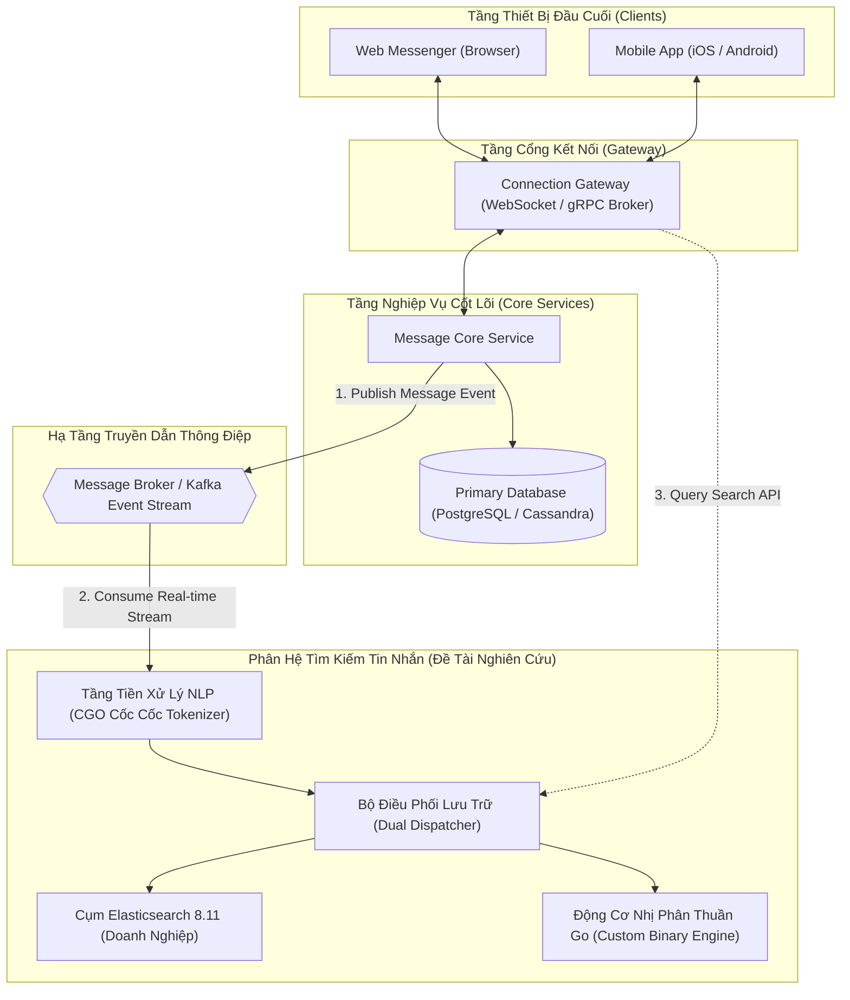

---

## 2. Hình 3.1: Minh họa cấu trúc Chỉ mục đảo (Inverted Index) và Danh sách Postings

### Lựa chọn 1: Chuẩn Giáo Trình IR Manning (Khuyên dùng - Chuẩn khoa học máy tính, không bao giờ bị lệch thứ tự)

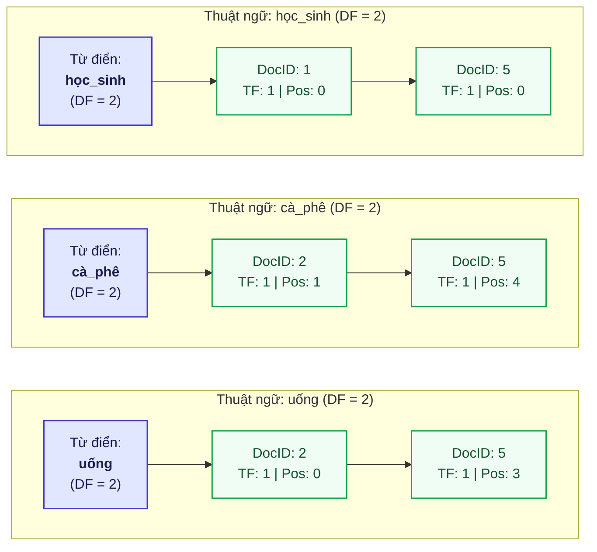

### Lựa chọn 2: Dạng 2 Khung Lớn (Lexicon bên trái, Postings bên phải)

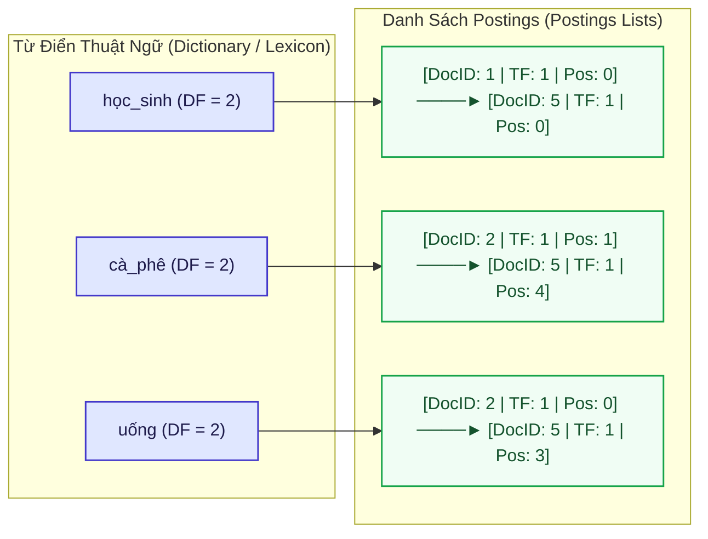

---

## 3. Hình 3.2: Đồ thị trạng thái và Ma trận chuyển tiếp trong cấu trúc Double-Array Trie (DAT)

### Lựa chọn 1: Dàn 1 hàng ngang với Chữ trong ô tròn siêu to (36px Bold)

```mermaid
%%{init: {'theme': 'base', 'themeVariables': { 'fontSize': '22px', 'fontFamily': 'arial' }}}%%
graph LR
    Root(("Root<br>s=1")):::nodeState
    H(("s=2<br>'h'")):::nodeState
    O(("s=3<br>'o'")):::nodeState
    C(("s=4<br>'c'")):::nodeState
    Under(("s=5<br>'_'")):::nodeState
    S(("s=6<br>'s'")):::nodeState
    I(("s=7<br>'i'")):::nodeState
    N(("s=8<br>'n'")):::nodeState
    H2((("s=9<br>'h'<br>Valid Word"))):::nodeValid

    Root -- "BASE[1] + 'h'" --> H
    H -- "BASE[2] + 'o'" --> O
    O -- "BASE[3] + 'c'" --> C
    C -- "BASE[4] + '_'" --> Under
    Under -- "BASE[5] + 's'" --> S
    S -- "BASE[6] + 'i'" --> I
    I -- "BASE[7] + 'n'" --> N
    N -- "BASE[8] + 'h'" --> H2

    classDef nodeState font-size:36px,font-weight:bold,fill:#eef2ff,stroke:#4338ca,stroke-width:3px;
    classDef nodeValid font-size:26px,font-weight:bold,fill:#dcfce7,stroke:#15803d,stroke-width:4px;
```

### Lựa chọn 2: Bố cục uốn 2 tầng (Tỷ lệ vuông vắn cho Báo cáo A4 / Word, chữ to rõ ràng gấp 3 lần)

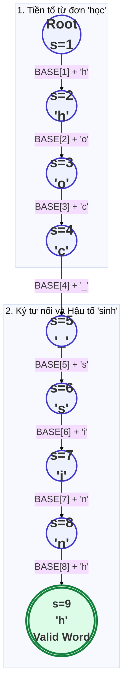

---

## 4. Hình 3.3: Đồ thị mạng lưới từ vựng (Word Lattice) và Đường giải mã tối ưu Viterbi HMM cho câu "học sinh học sinh học"

> **Lưu ý chuẩn hóa khi dùng trong draw.io:** Sơ đồ này phân tích ví dụ kinh điển về **Hiện tượng nhập nhằng giao thoa kép (Double Overlapping Ambiguity)** trong tiếng Việt với câu: *"học sinh học sinh học"* $\implies$ Kết quả giải mã chuẩn xác là: `["học_sinh", "học", "sinh_học"]`. Sơ đồ dùng mô hình chuẩn **Word Lattice Graph (Đồ thị mạng lưới từ vựng)** dạng DAG đơn tầng (từ trái sang phải), không sử dụng khối `subgraph` lồng ghép. Khi nhập vào draw.io (`Arrange -> Insert -> Advanced -> Mermaid`), 6 mốc Node 0 $\to$ Node 5 sẽ được dàn ngang thẳng hàng tuyệt đối, các cung từ đơn/từ ghép uốn lượn rõ ràng, đường đi tối ưu Viterbi được tô đậm màu xanh lá (`==>`).

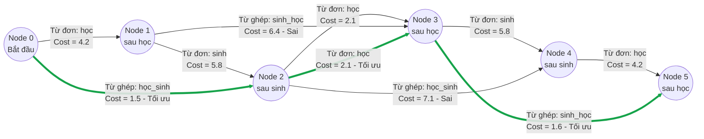

---

## 5. Hình 3.4: Kiến trúc lưu trữ Log-Structured Merge-Tree (LSM-Tree) và chu trình chuyển tiếp dữ liệu

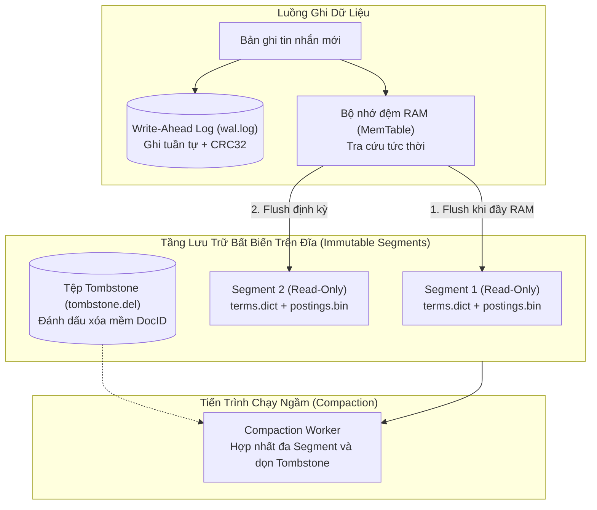

---

## 6. Hình 4.1: Bản đồ kiến trúc hệ thống tổng thể 3 tầng

*(Có sẵn ảnh chất lượng cao tại: `image/Cốc Cốc Search Engine-2026-09-22-065029.png`)*

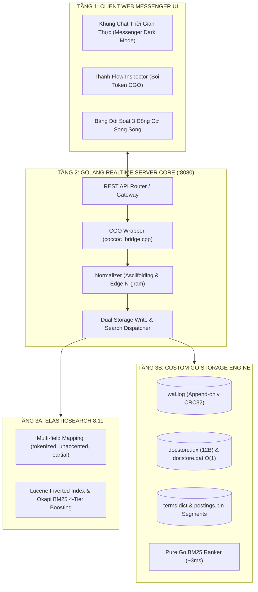

---

## 7. Hình 4.2: Sơ đồ tuần tự Luồng Đánh chỉ mục (Indexing Pipeline) và cơ chế Dual-Write Dispatcher

*(Có sẵn ảnh chất lượng cao tại: `image/The Life of a Write Sequence Diagram.png`)*

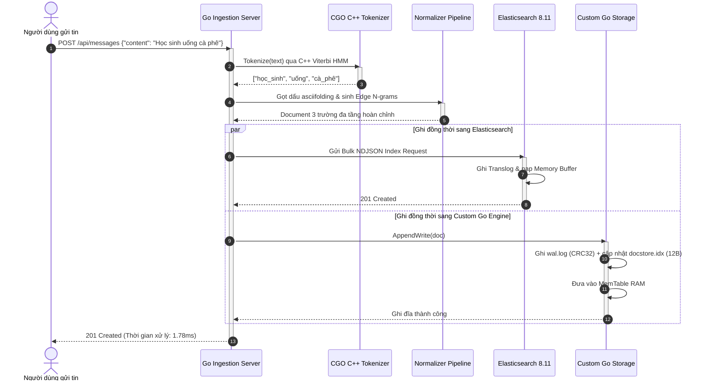

---

## 8. Hình 4.3: Sơ đồ tuần tự Luồng Truy vấn và cơ chế Boosting 4 tầng điểm số

*(Có sẵn ảnh chất lượng cao tại: `image/Cốc Cốc Search Engine-2026-09-18-073414.png`)*

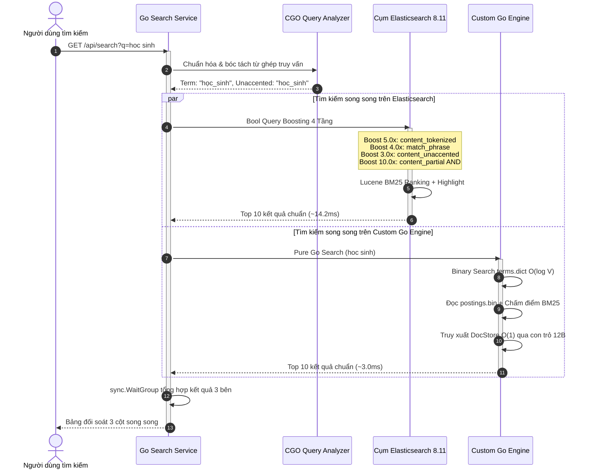

---

## 9. Hình 4.4: Sơ đồ cấu trúc nhị phân và quan hệ con trỏ giữa docstore.idx và docstore.dat

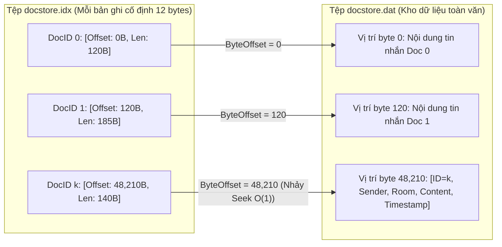

---

## 10. Hình 5.1 & Hình 5.2: Biểu đồ Benchmark IR và Tài nguyên phần cứng

*(Có sẵn ảnh chất lượng cao tại: `image/benchmark_ir_comparison.jpg`)*

Bạn có thể mở tệp [docs/render_diagrams.html](file:///d:/CODE/VSF/vietnamese-chat-search/docs/render_diagrams.html) để xem và chụp ảnh trực tiếp 2 biểu đồ cột tương tác này được dựng bằng Chart.js.
